# AWS Data Lakehouse: Apache Iceberg, Glue, Lambda & SFTP (Ambiente Local)

Este repositório contém o desenvolvimento de um **Data Lakehouse** moderno e transacional utilizando o formato de tabela aberto **Apache Iceberg**. A infraestrutura como código (IaC) é gerenciada via **Terraform** e emulada localmente com custo zero através do **Floci** e **Docker**.

O projeto simula um cenário real de engenharia de dados, orquestrando a ingestão de duas fontes públicas do Reino Unido e estruturando os dados sob os princípios da **Arquitetura Medallion**:

1. 🌐 **API REST (UK ONS):** Ingestão serverless via AWS Lambda dos dados históricos de inflação (CPI), convertidos e estruturados diretamente na camada Bronze do Lakehouse.
2. 📁 **Servidor SFTP (Simulado):** Extração de dados cadastrais de empresas britânicas utilizando a biblioteca `paramiko`. Os dados brutos passam por um pipeline de refino, nascendo como **Bronze** (dados brutos em Iceberg) e evoluindo para a camada **Silver** (dados higienizados e tipados).

### 💡 Diferenciais Técnicos Implementados:
- **Transações ACID Locais:** Integração do Apache Spark local com o AWS Glue Data Catalog emulado pelo Floci, utilizando o `S3FileIO` nativo do Iceberg.
- **Idempotência Avançada:** Uso da API V2 do Spark 3 (`writeTo.createOrReplace()`) para garantir pipelines reexecutáveis e contornar limitações de atualização atômica de metadados em ambientes de teste.
- **Isolamento de Negócio:** Scripts de processamento totalmente desacoplados por contexto de negócio (Inflation vs. Companies), facilitando a manutenção e a escalabilidade da plataforma.

---

## 🛠️ Pré-requisitos

Antes de começar, certifique-se de ter instalado em sua máquina:
* [Docker & Docker Compose](https://docs.docker.com/get-docker/)
* [Terraform CLI](https://developer.hashicorp.com/terraform/downloads) (Versão >= 1.5.0)
* [AWS CLI v2](https://docs.aws.amazon.com/cli/latest/userguide/getting-started-install.html)
* [Python 3.9+](https://www.python.org/downloads/) e `pip` (necessários apenas para empacotar as dependências da Lambda localmente)
* Criar o arquivo `src/lambdas/requirements.txt` com o conteúdo `paramiko==3.4.0`

---



---

## 🚀 Passo a Passo para Execução (Do Zero)

Siga rigorosamente a ordem dos passos abaixo para garantir que o Terraform consiga empacotar os códigos e que os containers se comuniquem corretamente.

### Passo 1: Preparar a estrutura de pastas e dados locais
1. Certifique-se de que a estrutura de pastas do projeto está criada conforme o desenho original.
2. Crie uma pasta chamada `sftp_data` na raiz do projeto:
   ```bash
   mkdir sftp_data
   ```
3. Crie um arquivo CSV de teste dentro dessa pasta para que o SFTP tenha o que ler:
  ```bash
  echo "id,company_name,status\n1,UK Tech Ltd,Active\n2,London Finance,Active" > sftp_data/companies_uk.csv
  ```

### Passo 2: Criar o Ambiente Virtual (venv) e Instalar Dependências
Para não poluir sua máquina, vamos isolar as dependências no venv e depois instalá-las na pasta da Lambda para o empacotamento do Terraform:
  ```bash
  # 1. Criar e ativar o ambiente virtual na raiz do projeto
  python -m venv venv
  source venv/bin/activate  # No Windows use: .\venv\Scripts\activate

  # 2. Instalar o requirements.txt diretamente na pasta da lambda
  cd src/lambdas/
  pip install -r requirements.txt -t .
  cd ../../
  ```
⚠️ Aviso: Este comando vai baixar várias pastas (como paramiko, cryptography, cffi) para dentro do seu diretório src/lambdas/. Isso é normal e necessário para o deployment de Lambdas com dependências externas.

### Passo 3: Subir os Containers do Docker
Agora que os arquivos de dados locais estão prontos, suba o Floci e o servidor SFTP na mesma rede virtual:
  ```bash
  docker-compose up -d
  ```
Verifique se os containers estão rodando com `docker ps`. O Floci estará pronto quando responder na porta 4566.

### Passo 4: Inicializar e Aplicar o Terraform (Workspace Local)
Navegue até a pasta do Terraform, crie o isolamento de ambiente (workspace) e aplique a infraestrutura:
  ```bash
  cd terraform

  # Inicializa os providers
  terraform init

  # Cria e ativa o workspace isolado para o ambiente local
  terraform workspace new local
  terraform workspace select local

  # Aplica a criação de Buckets, Lambdas, Roles e EventBridge
  terraform apply --auto-approve

  cd ../
  ```

### Passo 5: Fazer o Upload do Script do Glue para o S3
O AWS Glue precisa ler o script PySpark a partir de um bucket do S3. Como o Terraform não faz o upload de scripts de processamento dinâmicos por padrão, faça isso manualmente apontando para o Floci:

  ```bash
  aws --endpoint-url=http://localhost:4566 s3 cp src/glue_jobs/inflation/landing_to_iceberg_inflation.py s3://uk-lakehouse-landing-local/scripts/landing_to_iceberg_inflation.py
  aws --endpoint-url=http://localhost:4566 s3 cp src/glue_jobs/companies/landing_to_iceberg_companies.py s3://uk-lakehouse-landing-local/scripts/landing_to_iceberg_companies.py
  ```

### Testando o Pipeline de Ponta a Ponta
Com tudo de pé, vamos forçar a execução dos componentes (sem precisar esperar os 5 minutos do cron do EventBridge).

1. Ingestão 1: Executar Extrator da API (ONS)
  ```bash
  aws --endpoint-url=http://localhost:4566 lambda invoke --function-name uk_api_extractor_local output_api.txt --region us-east-1
  ```
cat output_api.txt # Deve exibir status 200 de sucesso
2. Ingestão 2: Executar Extrator do SFTP
  ```bash
  aws --endpoint-url=http://localhost:4566 lambda invoke --function-name uk_sftp_extractor_local output_sftp.txt --region us-east-1
  cat output_sftp.txt # Deve exibir status 200 de sucesso
  ```
3. Validar se os dados chegaram na Landing Zone
  ```bash
  aws --endpoint-url=http://localhost:4566 s3 ls s3://uk-lakehouse-landing-local/ --recursive --region us-east-1
  ```
Você deverá ver o arquivo inflation.json na pasta raw/ons/ e o arquivo companies_uk.csv na pasta raw/sftp/.
Nota de Arquitetura: Para contornar limitações de atualizações atômicas de metadados (UpdateTable) em emuladores locais do AWS Glue, o pipeline adota a estratégia de Drop e Create (ou createOrReplace na API V2) a cada execução. Isso força o Apache Iceberg a reiniciar o estado da tabela diretamente no catálogo emulado do Floci sem depender do método de atualização incremental do servidor, mantendo a estrutura de arquivos e o formato Parquet 100% idênticos aos padrões de produção da AWS.

4. Processamento: Disparar o AWS Glue Job (Gravação em Iceberg)
Agora, execute o Job Spark que lerá a Landing Zone, aplicará as transformações e salvará os dados catalogados no formato Apache Iceberg. Note, para companies, há uma simulação de camada silver. Para executá-la, é obrigatório a landing ser executada anteriormente:

  ```bash
  spark-submit --packages org.apache.iceberg:iceberg-spark-runtime-3.5_2.12:1.5.2,org.apache.iceberg:iceberg-aws-bundle:1.5.2,org.apache.hadoop:hadoop-aws:3.3.4,com.amazonaws:aws-java-sdk-bundle:1.12.262 --py-files src/glue_jobs/spark_utils.py src/glue_jobs/inflation/landing_to_iceberg_inflation.py
  spark-submit --packages org.apache.iceberg:iceberg-spark-runtime-3.5_2.12:1.5.2,org.apache.iceberg:iceberg-aws-bundle:1.5.2,org.apache.hadoop:hadoop-aws:3.3.4,com.amazonaws:aws-java-sdk-bundle:1.12.262 --py-files src/glue_jobs/spark_utils.py src/glue_jobs/companies/landing_to_iceberg_companies.py
  spark-submit --packages org.apache.iceberg:iceberg-spark-runtime-3.5_2.12:1.5.2,org.apache.iceberg:iceberg-aws-bundle:1.5.2,org.apache.hadoop:hadoop-aws:3.3.4,com.amazonaws:aws-java-sdk-bundle:1.12.262 --py-files src/glue_jobs/spark_utils.py  src/glue_jobs/companies/iceberg_companies_silver.py
  ```
Para validar a criação dos metadados transacionais e arquivos de manifesto do Iceberg, inspecione o bucket de Lakehouse (note o sufixo .db inserido pelo Glue Catalog):

  ```bash
  aws --endpoint-url=http://localhost:4566 s3 ls s3://uk-lakehouse-iceberg-local/warehouse/uk_economy_db_local.db/uk_cpi_inflation/ --recursive --region us-east-1
  aws --endpoint-url=http://localhost:4566 s3 ls s3://uk-lakehouse-iceberg-local/warehouse/uk_economy_db_local.db/uk_companies/ --recursive --region us-east-1
  ```

A estrutura final contará com as pastas:
 - data/: Contendo os arquivos .parquet altamente compactados e indexados de forma colunar.
 - metadata/: O coração do Iceberg. Você verá arquivos .metadata.json, .avro (manifest lists) e .snap (snapshots). São eles que permitem que o Lakehouse tenha propriedades ACID (Time Travel, Rollback e Schema Evolution) em cima de um armazenamento de objetos burro como o S3!

### 🔄 Como migrar para a AWS Real?
A beleza desta arquitetura baseada em Workspaces é a portabilidade. Para implantar na nuvem real da AWS:

1. Configure suas credenciais reais da AWS na sua máquina (aws configure).
2. Mude o workspace do Terraform:
  ```bash
  cd terraform
  terraform workspace new prod
  terraform workspace select prod
  ```
3. O bloco dynamic no arquivo providers.tf identificará que o workspace não é mais o local e removerá os redirecionamentos de portas. A condição count = 0 dos Glue Jobs passará a valer 1, criando toda a infraestrutura física, orquestradores e jobs nativamente na sua conta AWS Cloud. Basta rodar `terraform apply`.